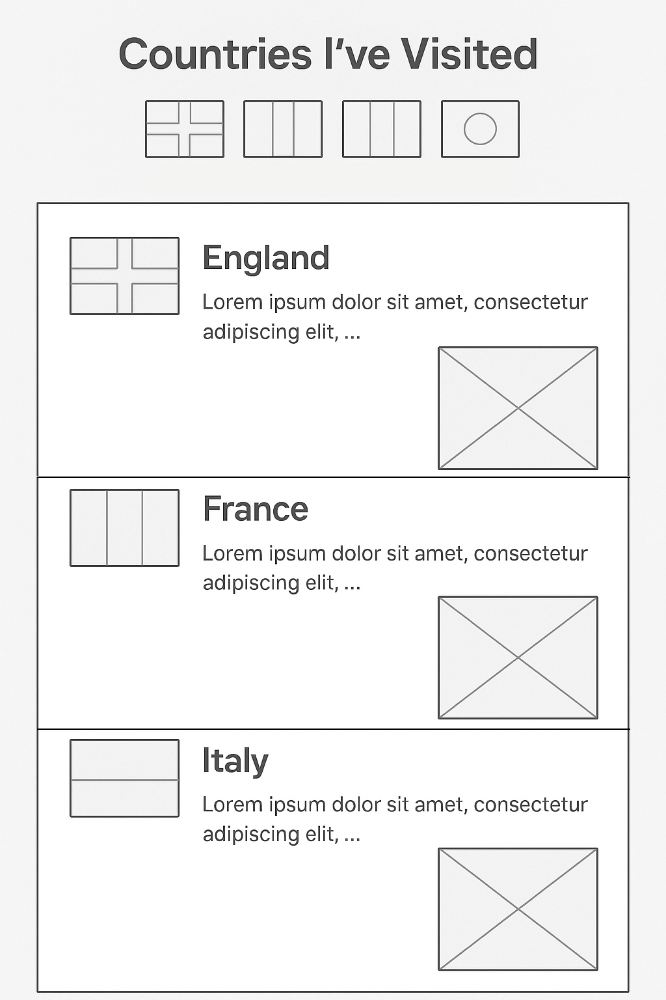

# track-visited-countries



1. index.html dosyası oluşturulacak ve içerisinde

- html
- head
- title
- body
  tagleri oluşturulacak.

2. h1 ile bir başlık koyulacak.
3. İlk başta bir div içerisinde img etiketleriyle ülke bayrakları yan yana sıralanacak.

- Ülke bayraklarını assets isimli bir klasör oluşturup bunun içerisinde de flags isimli bir klasör oluşturup buraya yüklemen gerekiyor. Flag'leri kolayca bulabileceğin bir paket linki: https://flagicons.lipis.dev Buradan download dedikten sonra flags/4x3 klasörünün içinden aradığın bayrakları bulup flags klasörüne taşırsın.

4. Sayfanın aşağısına ilerledikçe her ülke için ayrı bir div içerisinde

- h2 ile ülke ismi, h2 taginin başına da img ile ülke bayrağı koyulacak.
- p ile ülkeyle ilgili düşünceler
- img ile varsa o ülkeden bir görsel
  eklenecek.

5. Her ülkeyi kapsayan div'e ülkenin ismiyle bir id property'si atanacak örn: <div id="England"> şeklinde. Sonrasında yukarıda yan yana dizili bayraklara link ekleyerek sayfanın doğru kısıma kaymasını ayarlayabiliriz. Onun için de yukarıda yan yana koyduğumuz bayraklar aşağıdaki şekildeyken:

```html

```

bunları şu şekilde güncellememiz gerekiyor

```html
<a href="#England">
  
</a>
```

Burada yaptığımız değişiklikle bir görsele tıklandığında id property'si England kelimesine eşit olan div'e kaydır komutu vermiş oluyoruz.
